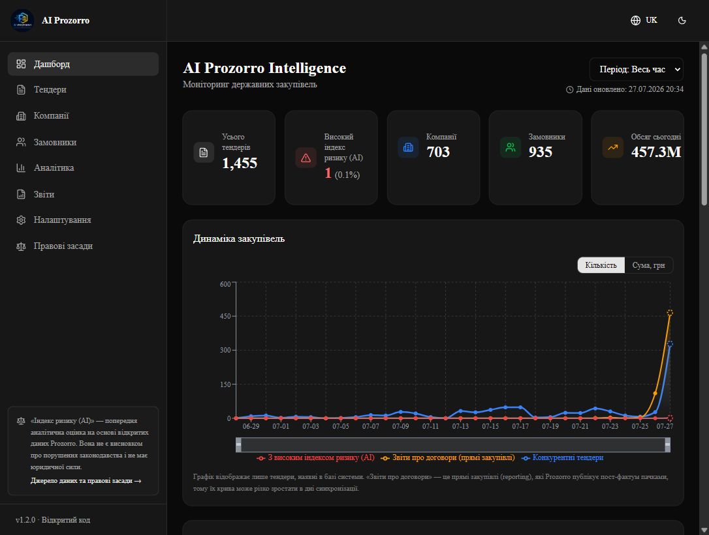
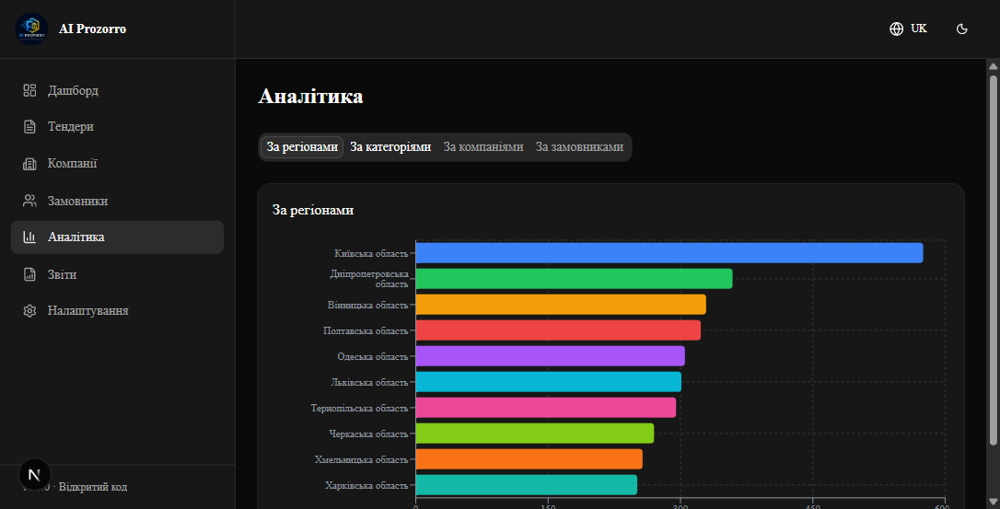
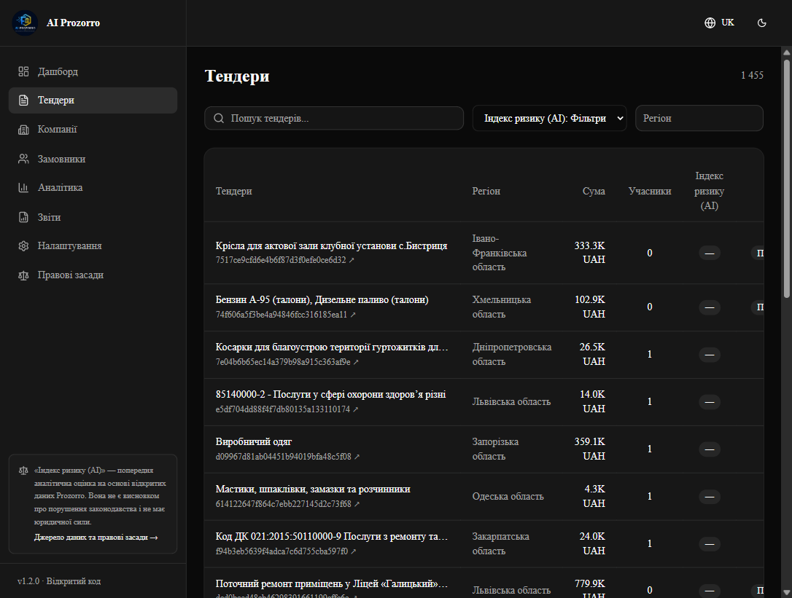
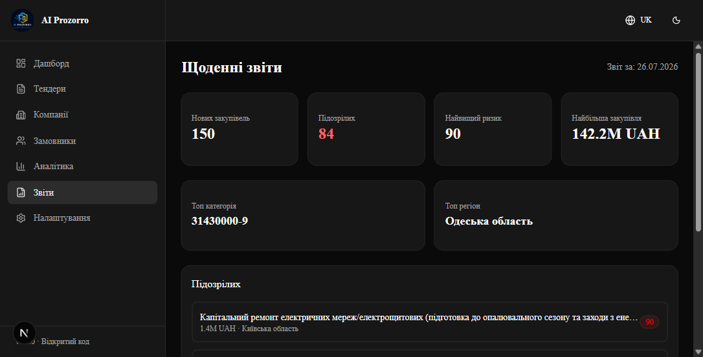

<div align="center">


# AI Prozorro Intelligence

**Відкрита AI-платформа моніторингу державних закупівель України**

Автоматичний збір тендерів з Prozorro • Індекс ризику (AI) • Аналітичний коментар до кожного тендера з високим індексом

[](https://www.python.org/)
[](https://fastapi.tiangolo.com/)
[](https://nextjs.org/)
[-F55036)](https://groq.com/)
[](LICENSE)

Українська 🇺🇦 | English 🇬🇧 — інтерфейс двомовний

</div>

---

## 📸 Скриншоти

### Дашборд
KPI-метрики з часткою тендерів з високим індексом ризику, динаміка закупівель (конкурентні тендери й звіти про договори окремо, перемикач «кількість ↔ сума», brush-зум), топи за індексом ризику з датами та посиланнями на Prozorro.



### Аналітика
Всі регіони України з точними значеннями на барах, категорії з розшифровкою кодів ДК 021:2015, топ компаній і замовників. Перемикач «кількість тендерів ↔ сума, грн» та фільтр періоду (7/30/90 днів).



### Тендери
Пошук, фільтри за індексом ризику/регіоном, сортування за сумою, ризиком і датою, прямі посилання на картку тендера в Prozorro.



### Щоденні звіти
Автоматичний звіт: нові тендери, обсяг, закупівлі дня з високим індексом ризику, найактивніший регіон.



---

## 🎯 Що вміє платформа

- **🔄 Автоматична синхронізація** — кожні 10 хвилин підтягує нові тендери з відкритого API Prozorro та оновлює існуючі (статус, учасники, ціни award); без дублікатів: унікальний індекс, перевірка перед імпортом і щоденна страхувальна дедуплікація. Збій обробки окремого тендера не зриває пакет — запис підтягнеться наступним циклом
- **⚖️ Типізація процедур** — конкурентні торги, спрощені закупівлі, переговорні процедури та звіти про договори (reporting) оцінюються за різними правилами: один учасник у прямій закупівлі — норма закону, а не сигнал ризику
- **⚠️ Індекс ризику (AI), 0–100** — власний рушій оцінки за зваженими факторами: один учасник, відсутність зниження ціни при реальній конкуренції (факт з даних award), «улюблені» постачальники замовника, ротація сталого пулу учасників, відхилення від 12-місячної медіани по CPV-категорії, стислі строки подання
- **🧠 Аналітичний коментар (AI)** — Llama 3.3 70B через Groq генерує структурований коментар за 9 критеріями: умови участі, строки, ціна (з порівнянням із категорією), конкуренція, історія переможця, зміни умов, оскарження, профіль замовника, ознаки ротації учасників. Коментар пишеться один раз; переаналіз — лише коли у незавершеного тендера зʼявилась нова інформація (статус, учасники, переможець, фінальна ціна)
- **📊 Аналітика** — розподіл закупівель за всіма регіонами, CPV-категоріями з розшифровкою ДК 021:2015, топ компаній-переможців і замовників (знеособлені оборонні постачальники позначаються окремо й не потрапляють у рейтинги)
- **📅 Щоденні звіти** — зведення дня + автоматична відправка в Telegram через n8n webhook 4 рази на день: о 10:00, 13:00, 16:00 та 19:00 за Києвом
- **⚖️ Правові засади** — окрема сторінка з джерелами даних, законодавчою базою відкритих даних та дисклеймером: індекс ризику є попередньою аналітичною оцінкою і не має юридичної сили
- **🌐 Двомовність** — повністю українська та англійська локалізації (next-intl)
- **📱 Адаптивність** — телефони, планшети, компʼютери (мобільне меню, горизонтальний скрол таблиць, доступ по локальній мережі)
- **🌙 Темна/світла тема** • мітка «Дані оновлено» на кожній сторінці

---

## 🏗️ Архітектура

```
┌─────────────────┐     кожні 10 хв      ┌──────────────────────────┐
│  Prozorro API   │ ───────────────────► │  FastAPI Backend          │
│  (відкриті дані)│                      │  • Sync Service           │
└─────────────────┘                      │  • Risk Engine            │
                                         │  • AI Analyzer (Groq)     │
┌─────────────────┐                      │  • APScheduler            │
│  Groq API       │ ◄─────────────────── │  • SQLite / PostgreSQL    │
│  Llama 3.3 70B  │   rate limited       └────────────┬─────────────┘
└─────────────────┘   28 req/хв, 950/день             │ REST API
                                         ┌────────────▼─────────────┐
┌─────────────────┐    webhook           │  Next.js 16 Frontend      │
│  n8n → Telegram │ ◄─────────────────── │  • Дашборд • Аналітика    │
│  (сповіщення)   │                      │  • Тендери • Звіти        │
└─────────────────┘                      │  • Правові засади • UK/EN │
                                         └──────────────────────────┘
```

### Технології

| Шар | Стек |
|---|---|
| Backend | Python 3.13, FastAPI, SQLAlchemy 2.0 (async), APScheduler |
| База даних | SQLite (локально) / PostgreSQL — Neon (продакшн) |
| AI | Groq API — `llama-3.3-70b-versatile` (безкоштовний тариф) |
| Frontend | Next.js 16, TypeScript, Tailwind CSS, shadcn/ui, Recharts, next-intl |
| Автоматизація | n8n (Telegram-сповіщення), Docker Compose |
| Хмара | Neon + Render (авто-деплой з GitHub) + Vercel |

---

## 🚀 Швидкий старт

### Вимоги

- Python 3.13+
- Node.js 20+
- Безкоштовний API-ключ [Groq](https://console.groq.com/)

### 1. Клонування та налаштування

```bash
git clone https://github.com/dev-arthur-petrunko/AI_Prozorro_Intelligence.git
cd AI_Prozorro_Intelligence

# Створіть .env з прикладу та вкажіть свій GROQ_API_KEY
cp .env.example .env
```

### 2. Backend

```bash
cd backend
python -m venv venv
venv\Scripts\activate        # Windows
# source venv/bin/activate   # Linux/macOS
pip install -r requirements.txt
python -m uvicorn app.main:app --host 0.0.0.0 --port 8000
```

При першому запуску база створиться автоматично і почнеться імпорт останніх тендерів з Prozorro.

### 3. Frontend

```bash
cd frontend
npm install
npm run dev
```

Відкрийте **http://localhost:3000** — платформа готова.

### 4. Доступ з телефона (опційно)

Запустіть `firewall-setup.ps1` від імені адміністратора (відкриває порти 3000/8000) і відкрийте `http://<IP-компʼютера>:3000` з телефона в тій самій Wi-Fi мережі.

---

## ☁️ Деплой у хмару (безкоштовно)

Платформа розгортається на безкоштовних тарифах: **Neon** (PostgreSQL) + **Render** (бекенд, авто-деплой з GitHub) + **Vercel** (фронтенд).

📖 Повна покрокова інструкція: **[DEPLOYMENT.md](DEPLOYMENT.md)**

---

## ⚙️ Конфігурація (.env)

| Змінна | Опис | За замовчуванням |
|---|---|---|
| `GROQ_API_KEY` | Ключ Groq API для AI-аналізу | — (обовʼязково) |
| `GROQ_MODEL` | Модель LLM | `llama-3.3-70b-versatile` |
| `GROQ_MAX_REQUESTS_PER_MINUTE` | Ліміт запитів до Groq за хвилину | `28` |
| `GROQ_MAX_REQUESTS_PER_DAY` | Ліміт запитів до Groq за день | `950` |
| `SYNC_INTERVAL_MINUTES` | Частота синхронізації з Prozorro | `10` |
| `DATA_RETENTION_DAYS` | Вікно збереження даних (ковзне, ~6 місяців) | `180` |
| `N8N_WEBHOOK_URL` | Webhook n8n для Telegram-сповіщень | опційно |
| `DASHBOARD_SUSPICIOUS_MIN_AMOUNT` | Мінімальна сума для топу за індексом ризику, грн | `10000` |
| `BACKEND_CORS_ORIGINS` | Дозволені origin для API | `http://localhost:3000` |

---

## 📡 Основні API ендпоінти

| Метод | Шлях | Опис |
|---|---|---|
| `GET` | `/dashboard?days=7\|30\|90` | KPI, живий графік (конкурентні/звіти/високий індекс), топи за пріоритетом уваги |
| `GET` | `/tenders` | Список тендерів: пошук, фільтри (`risk_min`, `region`), сортування |
| `GET` | `/tenders/{id}` | Деталі тендера з аналітичним коментарем (AI) і ризик-факторами |
| `GET` | `/analytics?days=7\|30\|90` | Всі регіони, категорії з назвами ДК 021:2015, топ компаній/замовників |
| `GET` | `/daily-report` | Щоденний звіт |
| `GET` | `/health` | Стан сервісу + час останньої синхронізації |
| `POST` | `/admin/run-ai-analysis` | Ручний запуск AI-аналізу (`?force=true&limit=N`) |
| `POST` | `/admin/run-analytics` | Ручний перерахунок аналітики |

Інтерактивна документація: **http://localhost:8000/docs** (Swagger UI)

---

## 🤖 Як рахується Індекс ризику (AI)

**1. Типізація процедури** (`procurementMethodType`): конкурентні торги (стеля 100), спрощені закупівлі (стеля 50), переговорні процедури (стеля 55), звіти про договори (стеля 55). Фактори конкуренції застосовуються лише там, де конкуренція передбачена процедурою.

**2. Зважені фактори** (бали підсумовуються):

| Фактор | Бали | Умова |
|---|---|---|
| Лише один учасник | +25 | тільки конкурентні процедури |
| Відсутність зниження ціни при конкуренції | +10 | 2+ учасники, фінальна ціна ≈ очікуваній (факт з award) |
| Переможець регулярно виграє у замовника | +25 | 3+ попередніх перемог у того ж замовника |
| Ротація сталого пулу учасників | +20 | 2–3 компанії ділять 4+ перемог у одного замовника |
| Сума вище медіани по категорії | +15 | >150% медіани CPV-категорії за останні 12 місяців |
| Ціна за одиницю вище медіани | +15 | >150% медіани питомої ціни по CPV + одиниці виміру; лише при кількості > 1 (інакше дублює фактор суми) |
| Короткий термін подачі | +10 | ≤3 днів від публікації до дедлайну (конкурентні) |
| Незвичайно висока сума | +5 | >3× медіани по всій базі |

**3. Пороги:** 0–30 низький · 31–55 середній · 56–80 високий · 81+ критичний. Аналітичний коментар (AI) за 9 критеріями генерується для тендерів з топів дашборду (завершені та активні, усі варіанти періоду) — денна квота Groq витрачається лише на те, що бачить користувач. У топах сортування йде за **пріоритетом уваги** = індекс × log₁₀(сума), щоб дрібні закупівлі не витісняли великі; якщо тендерів з високим індексом менше 10 — список добирається каскадом строго за рівнем індексу (55 → 50 → 45 → 40).

**4. Життєвий цикл коментаря:** генерується один раз; переаналіз — лише якщо у незавершеного тендера зʼявились нові дані. Завершені тендери з готовим коментарем не переаналізовуються. Історичні дані для критеріїв «історія переможця / профіль замовника / ротація» охоплюють ковзне вікно ~6 місяців (`DATA_RETENTION_DAYS=180`).

> ⚖️ **Дисклеймер:** «Індекс ризику (AI)» — попередня аналітична оцінка на основі відкритих даних Prozorro. Вона не є висновком про порушення законодавства, звинуваченням чи офіційним рішенням і не має юридичної сили. Остаточну оцінку може надати лише уповноважений державний орган (АМКУ, ДАСУ). Повний текст — на сторінці «Правові засади» платформи.

---

## 🗂️ Структура проєкту

```
├── backend/
│   └── app/
│       ├── api/routes/      # dashboard, tenders, analytics, reports, health
│       ├── ai/              # Risk Engine (типізація процедур), Groq клієнт, AI analyzer
│       ├── analytics/       # агрегації, CPV-довідник ДК 021:2015, retention + дедуплікація
│       ├── collectors/      # Prozorro API клієнт, нормалізація, синхронізація
│       ├── models/          # Tender, Company, Buyer, AnalyticsSnapshot
│       └── scheduler/       # APScheduler задачі
├── frontend/
│   └── src/
│       ├── app/[locale]/    # дашборд, тендери, аналітика, звіти, правові засади (UK/EN)
│       ├── components/      # UI, графіки, бейджі ризику/статусу
│       └── services/api.ts  # REST клієнт
├── n8n/                     # Workflow для Telegram-сповіщень
├── docs/screenshots/        # Скриншоти для README
└── docker-compose.yml       # PostgreSQL + n8n
```

---

## 🆕 Оновлення

### v1.4.5 (липень 2026)

- **Типізація процедур** — конкурентні торги, спрощені закупівлі, переговорні процедури та звіти про договори оцінюються за різними правилами
- **Нові фактори Індексу ризику (AI)** — ротація сталого пулу учасників, відсутність зниження ціни при реальній конкуренції, порівняння з 12-місячною медіаною CPV-категорії, аналіз ціни за одиницю (quantity/unit_price)
- **Аналітичний коментар (AI) за 9 критеріями** — переаналіз лише коли у незавершеного тендера з'явились нові дані
- **Дашборд** — перемикач «кількість ↔ сума», brush-зум графіка, топи за пріоритетом уваги з датами та посиланнями на Prozorro
- **Аналітика** — всі регіони України зі значеннями на барах, розшифровка кодів ДК 021:2015, фільтр періоду 7/30/90 днів
- **Сторінка «Правові засади»** — джерела даних, законодавча база, юридичний дисклеймер
- **Telegram-звіти через n8n** — 4 рази на день (10:00, 13:00, 16:00, 19:00 за Києвом), ендпоінт ручної перевірки `/admin/send-daily-report`
- **Точніший промт AI-коментаря** — врахування типу процедури у критерії конкуренції, день тижня публікації в даних, чесне «недостатньо даних» для скарг АМКУ, пост-валідація формату відповіді з ретраєм; вікно історичних даних розширено до ~6 місяців
- **Хмарний деплой** — Neon + Render + Vercel, авто-деплой з GitHub, мітка «Дані оновлено» на кожній сторінці

---

## 📄 Ліцензія та правові засади

Проєкт з відкритим кодом. Дані — з відкритого API [Prozorro](https://prozorro.gov.ua/): публічна інформація у формі відкритих даних (ЗУ «Про доступ до публічної інформації», ЗУ «Про публічні закупівлі», Постанова КМУ № 835).

Платформа не є ЗМІ та не здійснює журналістських розслідувань — це інструмент аналітики на основі відкритих даних для інформаційних цілей.

Створено для підвищення прозорості державних закупівель України 🇺🇦
